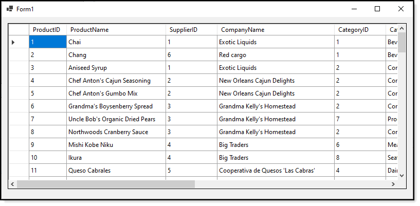
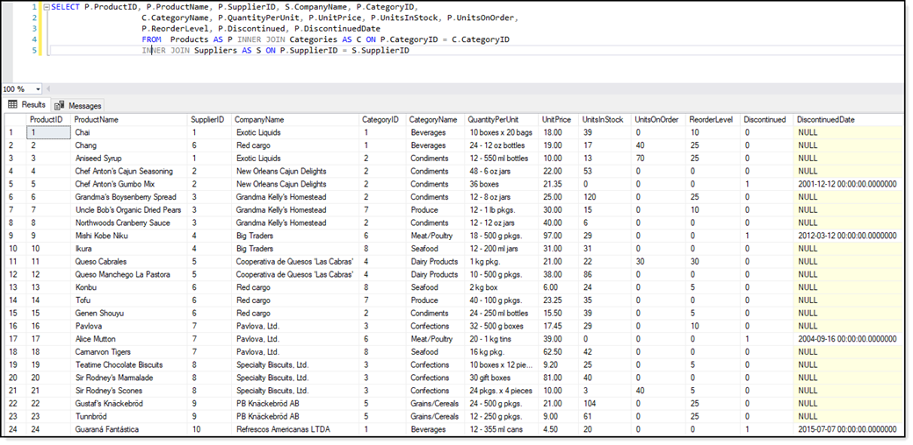
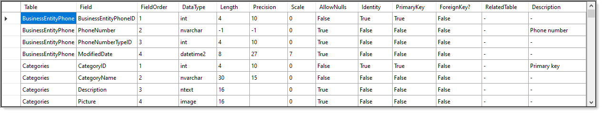

# About

Sample to open tables in [SQL-Server](https://docs.microsoft.com/en-us/sql/?view=sql-server-ver15) using [SqlConnection](https://docs.microsoft.com/en-us/dotnet/api/system.data.sqlclient.sqlconnection?view=dotnet-plat-ext-5.0) data provider 
with [asynchronous](https://docs.microsoft.com/en-us/dotnet/csharp/programming-guide/concepts/async/) operations and given timeout for a connection, see the [following article](https://social.technet.microsoft.com/wiki/contents/articles/54260.sql-server-freezes-when-connecting-c.aspx) for more details.


:heavy_check_mark: This is a no-frills user interface.

:heavy_check_mark: Uses C#8, C#9 features



## Entity Framework Core

Although working with a SqlConnection object and SqlCommand object fits many situations, consider exploring working with [Entity Framework Core](https://docs.microsoft.com/en-us/ef/core/). See the following [TechNet article](https://social.technet.microsoft.com/wiki/contents/articles/53881.entity-framework-core-3-projections.aspx) for a intermediate example (the version is back one version but will work with the current version)


# Requires 

:heavy_check_mark: The following [database script](https://gist.github.com/karenpayneoregon/9bdf1a7d5310ac1d562b2326d79d6038) to run.


Once this project is open in Visual Studio with .NET 5 installed, double click on the project 
node (the project name) in Visual Studio which open too.

Note if this was a console app remove the **-window** section from the TargetFramework node.


```xml
<Project Sdk="Microsoft.NET.Sdk">


	<PropertyGroup>
		<OutputType>WinExe</OutputType>
		<LangVersion>9.0</LangVersion>
		<TargetFramework>net5.0-windows</TargetFramework>
		<UseWindowsForms>true</UseWindowsForms>
	</PropertyGroup>


	<ItemGroup>
	  <PackageReference Include="System.Data.SqlClient" Version="4.8.2" />
	</ItemGroup>


</Project>
```

# Data container

:green_circle:  **DataTableResults**

| Property | Type | Definition
| :---- | :---- | :----
| DataTable | DataTable | Container to return data
| ConnectionFailed | bool | Set when there is a connection to the server failure
| ExceptionMessage | string | General exception message
| GeneralException | Exception | General exception if not connection failure
| HasException | bool | Indicates if there was an exception thrown

:green_circle:  Contains concrete class for returning data for DataOpertions.ReadProductsTask().


Note the `ItemGroup` section, this informs .NET that a package for `System.Data.SqlClient` is needed. When building this project Visual Studio should restore the package and if not
 right click on the project name in solution explorer, select `manage NuGet packages`, do a restore by pressing the restore button.

Or simply install via [instructions here](https://www.nuget.org/packages/System.Data.SqlClient/).

Now build the project.

# SQL

The SQL statement was created in SSMS (SQL-Server Management Studio) and pasted into DataOperations.SelectStatement().



# Database details

The following would be used even if working with Entity Framework to get table details in a database.



```csharp
namespace SqlOperations.Classes
{
    public class DataOperations
    {
        private static readonly string ConnectionString = "TODO";
        

        public static DataTable DatabaseTableDetails()
        {
            using var cn = new SqlConnection(ConnectionString);
            using var cmd = new SqlCommand { Connection = cn, CommandText = DatabaseDetailsSelectStatement };
            
            cn.Open();
            var dt = new DataTable();
            
            dt.Load(cmd.ExecuteReader());

            return dt;
        }

        private static string DatabaseDetailsSelectStatement =>
            @"
            SELECT	syso.name [Table],
		            sysc.name [Field], 
		            sysc.colorder [FieldOrder], 
		            syst.name [DataType], 
		            sysc.[length] [Length], 
		            sysc.prec [Precision], 
            CASE WHEN sysc.scale IS null THEN '-' ELSE sysc.scale END [Scale], 
            CASE WHEN sysc.isnullable = 1 THEN 'True' ELSE 'False' END [AllowNulls], 
            CASE WHEN sysc.[status] = 128 THEN 'True' ELSE 'False' END [Identity], 
            CASE WHEN sysc.colstat = 1 THEN 'True' ELSE 'False' END [PrimaryKey],
            CASE WHEN fkc.parent_object_id is NULL THEN 'False' ELSE 'True' END [ForeignKey?], 
            CASE WHEN fkc.parent_object_id is null THEN '-' ELSE obj.name  END [RelatedTable],
            CASE WHEN ep.value is NULL THEN '-' ELSE CAST(ep.value as NVARCHAR(500)) END [Description]
            FROM [sys].[sysobjects] AS syso
            JOIN [sys].[syscolumns] AS sysc on syso.id = sysc.id
            LEFT JOIN [sys].[systypes] AS syst ON sysc.xtype = syst.xtype and syst.name != 'sysname'
            LEFT JOIN [sys].[foreign_key_columns] AS fkc on syso.id = fkc.parent_object_id and sysc.colid = fkc.parent_column_id    
            LEFT JOIN [sys].[objects] AS obj ON fkc.referenced_object_id = obj.[object_id]
            LEFT JOIN [sys].[extended_properties] AS ep ON syso.id = ep.major_id and sysc.colid = ep.minor_id and ep.name = 'MS_Description'
            WHERE syso.type = 'U' AND  syso.name != 'sysdiagrams'
            ORDER BY [Table], FieldOrder, Field;
";


    }
}
```

Or to get one table

```sql
--- this would be a parameter for the command object
DECLARE @TableName AS nvarchar(20) = 'BusinessEntityPhone'

SELECT	syso.name [Table],
		sysc.name [Field], 
		sysc.colorder [FieldOrder], 
		syst.name [DataType], 
		sysc.[length] [Length], 
		sysc.prec [Precision], 
CASE WHEN sysc.scale IS null THEN '-' ELSE sysc.scale END [Scale], 
CASE WHEN sysc.isnullable = 1 THEN 'True' ELSE 'False' END [AllowNulls], 
CASE WHEN sysc.[status] = 128 THEN 'True' ELSE 'False' END [Identity], 
CASE WHEN sysc.colstat = 1 THEN 'True' ELSE 'False' END [PrimaryKey],
CASE WHEN fkc.parent_object_id is NULL THEN 'False' ELSE 'True' END [ForeignKey?], 
CASE WHEN fkc.parent_object_id is null THEN '-' ELSE obj.name  END [RelatedTable],
CASE WHEN ep.value is NULL THEN '-' ELSE CAST(ep.value as NVARCHAR(500)) END [Description]
FROM [sys].[sysobjects] AS syso
JOIN [sys].[syscolumns] AS sysc on syso.id = sysc.id
LEFT JOIN [sys].[systypes] AS syst ON sysc.xtype = syst.xtype and syst.name != 'sysname'
LEFT JOIN [sys].[foreign_key_columns] AS fkc on syso.id = fkc.parent_object_id and sysc.colid = fkc.parent_column_id    
LEFT JOIN [sys].[objects] AS obj ON fkc.referenced_object_id = obj.[object_id]
LEFT JOIN [sys].[extended_properties] AS ep ON syso.id = ep.major_id and sysc.colid = ep.minor_id and ep.name = 'MS_Description'
WHERE syso.type = 'U' AND  syso.name != 'sysdiagrams' AND syso.name = @TableName
ORDER BY [Table], FieldOrder, Field;
```