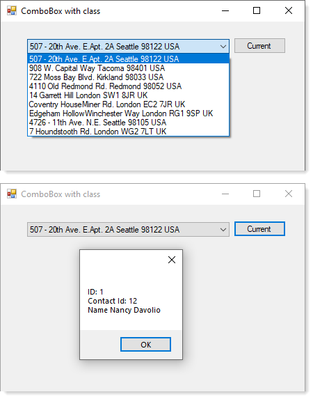

# About

Shows how to populate a [ComboBox](https://docs.microsoft.com/en-us/dotnet/api/system.windows.forms.combobox?view=net-5.0) from SQL-Server, show several columns concatenated. Get get an any column/property a [BindingSource](https://docs.microsoft.com/en-us/dotnet/api/system.windows.forms.bindingsource?view=net-5.0) is used, cast to the proper type and displays several properties in a MessageBox.

:heavy_check_mark: script.sql has script to create database.

:heavy_check_mark: Classes are in the Classes folder

<kbd>👉</kbd> Used to respond to a [forum question](https://docs.microsoft.com/en-us/answers/questions/333768/binding-combobox-with-distinct-and-concatenated-va.html).

### Screenshots

