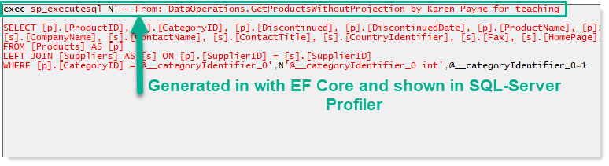

# About

Example for working with [SQL-Server](https://docs.microsoft.com/en-us/sql/?view=sql-server-ver15) performing same operations as in SqlOperations class project.

### Presented

- Projections: A projection is mapping one set of properties to another. In relation to Entity Framework specifically, it's a way of translating a full entity (database table) into a C# class with a subset of those properties. 
- [INotifyPropertyChanged](https://docs.microsoft.com/en-us/dotnet/api/system.componentmodel.inotifypropertychanged?view=net-5.0) Interface: Notifies clients that a property value has changed.

# See also

- Microsoft TechNet Entity Framework Core: [Projections and async operations](https://social.technet.microsoft.com/wiki/contents/articles/53881.entity-framework-core-3-projections.aspx)
- Microsoft docs, [projection operations](https://docs.microsoft.com/en-us/dotnet/csharp/programming-guide/concepts/linq/projection-operations)

# Misc

- **Query tags**: [.TagWith](https://docs.microsoft.com/en-us/ef/core/querying/tags) (see figure 1)
- **Tracking**: [Tracking vs No-Tracking Queries](https://docs.microsoft.com/en-us/ef/core/querying/tracking)

**Figure 1**

